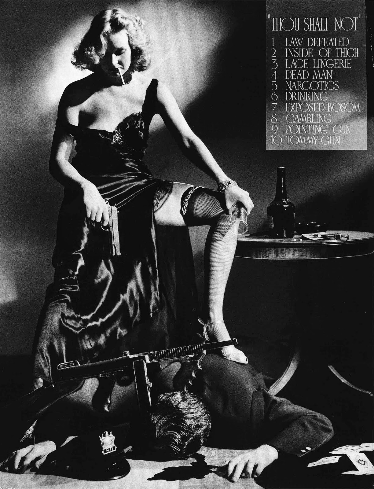

# First Amendment - Introduction

I wrote a *Wall Street Journal* article last year 
about the polarized debate surrounding the First Amendment 
and who gets to say what. It makes for an introduction of sorts. 
Please follow this link. 

<https://www.wsj.com/articles/justice-holmess-free-speech-lesson-1507847318>

I like the two monkeys, but if you hit a paywall, 
please find the text below:

## Justice Holmes's Free-Speech Lesson

###### The more certain you are, the more you should resist the temptation to silence those who disagree.

### By Richard Dooling

###### Oct. 12, 2017 6:28 p.m. ET

If you are absolutely certain that President Trump is or is not an idiot, that climate change is or is not the most pressing problem of our age, that abortion is or is not murder, that football players should or should not be allowed to kneel during the national anthem, that our nation needs more or fewer gun laws, welcome! Most of us feel the same way. Absolute certainty is common, as is the suspicion that anybody who is absolutely certain of the opposite view must be evil, ignorant or a gullible consumer of fake news.

Along with absolute certainty comes the understandable impulse to regulate or ban the speech of your opponent. Why allow evil and ignorant people to infect others with falsehoods and dangerous ideas? Why not take away the licenses of broadcasters whose news departments have the wrong slant? Why not make hate speech illegal?

Almost a century ago, Justice Oliver Wendell Holmes Jr., wrestled with similar questions in a pair of Espionage Act cases. Holmes was absolutely certain that in most cases individual rights are subordinate to the needs of the state, and that the First Amendment did not protect an American citizen named Charles Schenck from prosecution for printing and mailing circulars opposing the draft.

In 1919 Holmes wrote to that effect for a unanimous Court in *Schenck v. U.S.*, famous for the misbegotten "fire in a crowded theater" analogy. *Schenck* also introduced the "clear and present danger" test, which most people think of as speech-protective, but according to Holmes and his colleagues was not enough to protect a man who merely advocated resisting the draft.

Nine months later, in *Abrams v. U.S.*, Holmes changed his mind about the First Amendment. As described in Thomas Healy’s 2013 book, “The Great Dissent,” Holmes reconsidered his position after reading articles and books sent to him by Zechariah Chafee, Harold Laski and other prominent free-speech advocates.

Holmes’s dissent in *Abrams* gave birth to modern First Amendment jurisprudence, with its veneration for the marketplace of ideas. He began by observing that it makes perfect sense to persecute people for their opinions: “If you have no doubt of your premises or your power and want a certain result with all your heart you naturally express your wishes in law and sweep away all opposition.” The problem, Holmes realized, is that we are almost always absolutely certain of our premises, but sometimes we are wrong.

Consider the contemporary example of gay rights. The American Psychiatric Association publishes a reference guide, the Diagnostic and Statistical Manual of Mental Disorders, currently in its fifth edition. Originally published in 1952, the DSM listed homosexuality as a mental disorder of one kind or another until 1987. These days, some psychiatrists are pushing to have “homophobia” listed as a mental illness. If that happens, would the APA be announcing that a majority of its members were mentally ill until 1987?

Fifty years ago, the majority of psychiatrists, and the majority of people, were absolutely certain that homosexuality was a mental disorder. If we could go back in time and ask them if gay people should be allowed to argue in public that homosexuality is not a mental disorder, many of them would say no. We already “know” it is a mental illness—even medical doctors and the Supreme Court agree.

Holmes’s radical idea was that we are too often wrong. When we are wrong, the consequences can be dire. When we are not only absolutely certain but also right, what is the harm in allowing other views to be heard? The truth needs no protectors and will eventually win out, but nobody said it better than Holmes:

> When men have realized that time has upset many fighting faiths, they may come to believe even more than they believe the very foundations of their own conduct that the ultimate good desired is better reached by free trade in ideas—that the best test of truth is the power of the thought to get itself accepted in the competition of the market, and that truth is the only ground upon which their wishes safely can be carried out. That at any rate is the theory of our Constitution. It is an experiment, as all life is an experiment. Every year if not every day we have to wager our salvation upon some prophecy based upon imperfect knowledge. While that experiment is part of our system I think that we should be eternally vigilant against attempts to check the expression of opinions that we loathe and believe to be fraught with death.

Maybe you disagree with Justice Holmes. But thanks to the First Amendment, you are free to argue against him and let the best idea win.

Mr. Dooling teaches at the University of Nebraska College of Law and has published seven books.

Appeared in the October 13, 2017, print edition.

<https://www.wsj.com/articles/justice-holmess-free-speech-lesson-1507847318>

## What Do The Words Mean?

The First Amendment says: 

> Congress shall make no law respecting an establishment of religion, 
> or prohibiting the free exercise thereof; 
> or abridging the freedom of speech, or of the press; 
> or the right of the people peaceably to assemble, 
> and to petition the Government for a redress of grievances.

But as lawyers, agents and representatives working for artists, 
or as people who collaborate with and represent artists, 
we are usually not concerned about establishing religions 
or assembling to petition the government; 
we are concerned about *speech*. 
So an edited version of the First Amendment 
for those in the entertainment and publishing industries might go like this:

> Congress shall make no law &hellip; abridging the freedom of speech. 

Some First Amendment absolutists, like Justice Hugo Black, for instance, 
argue that the words mean what they say: 

> The First Amendment's language leaves no room for inference that abridgments of speech and press can be made just because they are slight. That Amendment provides, in simple words, that "Congress shall make no law . . . abridging the freedom of speech, or of the press." I read "no law . . . abridging" to mean no law abridging.

Most judges and scholars think the Founders had important rights in mind, 
but probably didn't mean literally Congress shall make no laws abridging anything that might be called speech.

[Eugene Volokh](http://en.wikipedia.org/wiki/Eugene_Volokh) 
argues that the problematic words are not "make no law," 
but rather "the freedom of speech." 
In speculating on what the Founders had in mind, Volokh had this to say.

> But nearly everyone, as best I can tell, 
> saw "freedom of speech" and "freedom of the press" 
> as providing less than complete constitutional protection 
> for spoken or printed words. 
> And this suggests that the term "freedom of" 
> referred to some understanding 
> that there is a proper scope of such freedom 
> (even if the scope was unsettled in some particulars), 
> rather than an unlimited freedom to say or print anything one pleases.

> It's much like, if tomorrow a state enacted a law 
> protecting "the freedom to marry," 
> we probably wouldn't think that it means the freedom to marry a 10-year-old, 
> or the freedom to marry one's daughter, 
> or (depending on the circumstances) 
> even the freedom to marry several people at once. 
> "The freedom to marry" would be seen as referring 
> to a broad but not unlimited concept 
> that is less than the freedom to marry anyone one pleases.

> Now, to be sure, during and after the controversy over the Sedition Act of 1798, 
> some foes of the Act argued that the First Amendment 
> did bar Congress from any authority to restrict spoken or printed words. 
> But I'm rather skeptical 
> that this was then or is now 
> a sound interpretation of the constitutional text.

* [Eugene Volokh on the meaning of "Congress shall make no law . .  ."](http://www.volokh.com/2012/09/19/the-founders-free-speechpress-clause/).

If not all speech is protected, 
then courts define what the Founders meant by the simple statement: 

> Congress shall make no law &hellip; abridging the freedom of speech.

### State Action

So much for *Congress* not making laws. 
Then we add the Fourteenth Amendment, which says:

> No State shall make or enforce any law 
> which shall abridge the privileges or immunities of citizens of the United States; 
> nor shall any State deprive any person of life, liberty, or property, 
> without due process of law; 
> nor deny to any person within its jurisdiction 
> the equal protection of the laws.

Read together, 
the First and Fourteenth Amendments prohibit *governments* 
from making laws abridging the freedom of speech. 
Private parties using private, lawful means 
may "abridge" the speech of others without causing First Amendment problems 
(e.g. by firing "speakers," or boycotting their performances, 
or slapping an NC-17 rating on their movies, 
or an [ESRB][esrb] warning on their video games.) 

So always look for *state action* first 
to determine if you have a First Amendment issue. 
The easiest way to check for state action? 
Look for a law (statute, ordinance, regulation), 
then look at the speech which supposedly violated the law. 

### What Is Speech?

The First Amendment obviously does not protect *all* speech. 
Author Kurt Vonnegut once observed that: 
"The First Amendment reads more like a dream than a law." 
Indeed. So what speech does it protect? 
Or is it easier to ask what speech is *not* protected by the First Amendment?
In the United States, the First Amendment protects speech, 
but what kinds of speech? Spoken words? Printed words? 
Any behaviors meant to convey a message? 
Flag burning? Movies? Video games? Nude dancing? Child pornography? 
Writing a book called: *How To Make A Suitcase Nuke?*

What about slander? Isn't that speech? 
Or fraud, or hiring somebody to murder your spouse, 
or lying to an IRS agent, or soliciting a prostitute? 

When courts try to decide whether speech is protected or unprotected 
they naturally wonder: 
Is this the sort of speech the Founding Fathers 
had in mind when they wrote the First Amendment?
As far as we know, no framer of the Constitution said, 
"Yay, free speech, but what *is* speech? 
Did the Founding Fathers mean to say 
that public nudity, live sex acts, and bestiality are all speech, 
and therefore Congress had no power to pass laws against such "expressive conduct"? 
Did they believe that live sex acts are like flag burning or marching in the streets? 
And did this mean that they believed Congress had no power to pass laws against obscenity, indecency, pornography, nude dancing and the like?

### What is the Purpose of the First Amendment?

Sounds like a question the professor might pose 
to kill twenty minutes of class time 
when he's unprepared to teach the next case, 
but the question lurks in the background of many a Supreme Court opinion. 

Why was the First Amendment added to the Constitution in 1791? 
And if Congress meant what it said 
about passing no laws abridging the freedom of speech, 
then why seven years later, in 1798, 
did Congress pass the [Alien and Sedition Acts](http://en.wikipedia.org/wiki/Alien_and_Sedition_Acts), 
which made it a crime for anyone to publish 
"false, scandalous, and malicious writing against the government or its officials?"

Do we have a First Amendment 
because speaking one's mind is a basic human right? 
Like the freedom to travel, or freedom to buy birth control? 
Perhaps the colonists wanted only to be certain 
that their new American government would be prohibited from imposing 
[prior restraints](http://en.wikipedia.org/wiki/Prior_restraint) on speech, 
the sort of licensing schemes that inspired the poet John Milton to write 
[Areopagitica](http://en.wikipedia.org/wiki/Areopagitica)? 
Maybe free speech is a kind of civic "safety valve" 
allowing aggrieved citizens to march in the streets 
or issue screeds on street corners 
instead of arming themselves and starting a civil war? 
Theories one and all that have been propounded 
as possible reasons we have a First Amendment.

#### The Marketplace of Ideas

When the Supreme Court addresses these questions, 
they steer between two competing principles of First Amendment jurisprudence 
that will never be reconciled (think [Scylla and Charybdis](http://en.wikipedia.org/wiki/Between_Scylla_and_Charybdis), a rock and a hard place, the horns of a dilemma).

One principle is called the marketplace of ideas, 
first formulated by Justice Oliver Wendell Holmes, who wrote:

> The best test of truth 
> is the power of the thought to get itself accepted 
> in the competition of the market. 

> --[*Abrams v. United States*](https://scholar.google.com/scholar_case?case=14321466231676186426) (US 1919)

To test the truth of what [Alex Jones](https://en.wikipedia.org/wiki/Alex_Jones) 
or [Alexandria Ocasio-Cortez](https://en.wikipedia.org/wiki/Alexandria_Ocasio-Cortez) has to say, 
let them fight it out in the marketplace and let's see whose idea wins.

"Dissents speak to a future age," as Justice Ginsberg once said, 
and, in *Abrams*, Holmes wrote the most influential dissent in the history of modern First Amendment jurisprudence. His marketplace was a radical idea, and it 
won out the in the competition for how to think about speech. 
Holmes imaged a marketplace where there's no such thing as good or bad speech, 
only speech that competes in the Darwinian marketplace and lives or dies. 
The Court's job is to strike down any attempts by the government 
to regulate the marketplace of ideas. 
So far, with limited well-defined exceptions, 
the Supreme Court will strike down any law
that purports to regulate or ban speech because of it's content or viewpoint. 

<!-- even when the government wants to say, "Wait, we aren't taking sides, we are just leveling the free speech playing field."  -->

#### Civic Republicanism

The second principle comes to us from Justice Louis Brandeis,
who offered a parallel and sometimes competing principle of First Amendment theory eight years later, when he described the purpose of the First Amendment:

> Those who won our independence &hellip; believed that freedom to think as you will and to speak as you think are means indispensable to the discovery and spread of political truth; that without free speech and assembly discussion would be futile. 

> --[*Whitney v. California*](https://scholar.google.com/scholar_case?case=9558803063364299687) (US 1927)

See how Justice Brandeis suggests that 
the First Amendment does not exist to protect *all* speech; 
it exists to protect speech 
that leads to the discovery and spread of "political truth." 
Brandeis wants to protect speech, 
not because it's an absolute value or good for the soul, 
but because it's essential for democracy 
and [civic republicanism](http://www.britannica.com/EBchecked/topic/1916872/civic-republicanism). Quite a different concern than Justice Holmes' marketplace 
where ideas fight it out for survival of the fittest. 
After his First Amendment epiphany in *Abrams*, 
Holmes would probably say 
that there is no such thing as "political truth." 
Truth is whatever the marketplace says it is. 
If cat videos beat out the President's State of the Union address, so be it.

Holmes did win out, but Supreme Court opinions still can't help suggesting on occasion that some speech is "low-value" speech, or less in need of protection than other speech. 
When they do that, they are usually citing Justice Brandeis 
and his view that we need speech to be good citizens and discuss politics, 
not to create pornography.

First Amendment cases in the United States Supreme Court are dramatic battles, 
usually between speakers with unpopular or dangerous views 
and governments that want to ban or censor their speech. 
What will happen when the family of a fallen veteran 
sues the Westboro Baptist Church for picketing their son's funeral? 
Or what about virtual child pornography? 
Or pornography made without using real children, 
and all of the "actors" are computer generated? 
Is virtual child pornography subject to the same extremely serious penalties 
that the government imposes on 
creating, possessing, or distributing child pornography 
created by using real child actors? 

But a film producer or a director or a screenwriter or author 
needs an entertainment lawyer, not a con law scholar, 
so we try to be practical whenever possible.
We are most concerned if our client's speech can be characterized 
as "unprotected speech" because it's defamatory, or obscene, 
invades someone's privacy, or is "indecent" because it's broadcast TV and its primetime.

## Are Movies Speech?

Oh, what might have been! 
In 1915, when the motion picture business was still in its infancy 
many states censored movies as a matter of course. 
The first time a case arguing that the "boards of censors" 
interfered with the First Amendment rights of people 
who displayed the films or wanted to see them, 
the United States Supreme Court said: I beg your pardon? 
Movies are *not* speech.

### *Mutual Film Corp. v. Industrial Commission of Ohio*

###### U.S. Supreme Court (1915)

* [case at Google Scholar](http://scholar.google.com/scholar_case?case=7270078849202844362)
* [case on Westlaw](http://lawschool.westlaw.com/shared/westlawRedirect.aspx?task=find&cite=35+S.Ct.+387&appflag=67.12)
* [case at Wikipedia.](http://en.wikipedia.org/wiki/Mutual_Film_Corporation_v._Industrial_Commission_of_Ohio) 

The state government of Ohio had passed a statute in 1913 forming a board of censors which had the duty of reviewing and approving all films intended to be exhibited in the state. 

Under the Ohio law: 

> Only such films as are in the judgment and discretion of the board of censors of a moral, educational or amusing and harmless character shall be passed and approved by such board.

The Ohio Board charged a fee for the approval service, 
and the Board could order the arrest of anyone showing an unapproved film in the state. 

When Mutual Film Corporation, a movie distributor, sued the Board arguing that this licensing scheme and Ohio's censorship of movies violated its freedom of speech, the company lost in the lower court and then appealed to the United States Supreme Court. 

In a unanimous opinion, the Supreme Court noted the insidious power of movies to affect the sensibilities of women and children and dismissed Mutual Film's "freedom of speech" arguments without a second thought: 

> The exhibition of moving pictures is a business pure and simple, originated and conducted for profit, like other spectacles, not to be regarded &hellip; as part of the press of the country or as organs of public opinion. They are mere representations of events, of ideas and sentiments published and known, vivid, useful and entertaining no doubt, but, as we have said, capable of evil, having power for it, the greater because of their attractiveness and manner of exhibition.

### The Hays Code

Hollywood panicked at the prospect of trying to distribute movies 
in fifty different states 
with fifty different boards of censorship 
and fifty different ideas about what makes a film 
"moral, educational or amusing and harmless." 

From 1915 (the date of the *Mutual Film* decision) to 1952, 
the film industry zealously regulated itself 
to show the states they need not worry about censoring Hollywood movies. 
The industry created the infamous Motion Picture Production Code 
aka the "Hays Code" and aggressively enforced it. 

Named after Will H. Hays, 
president of the Motion Picture Producers and Distributors of America from 1922 to 1945, 
the Code had three general principles:

1. No picture shall be produced which will lower the moral standards of those who see it. Hence the sympathy of the audience shall never be thrown to the side of crime, wrong-doing, evil or sin.
2. Correct standards of life, subject only to the requirements of drama and entertainment, shall be presented.
3. Law, natural or human, shall not be ridiculed, nor shall sympathy be created for its violation. 

(From the Production Code, 1934)

The Code also had plenty of particular proscriptions, including no exposed bosoms and no tommyguns, 
best illustrated by the pic below.

### *Joseph Burstyn, Inc. v. Wilson*

######  U.S. Supreme Court (1952)

* [case at Google Scholar](http://scholar.google.com/scholar_case?case=5628256980652867975)
* [how cited at Google Scholar](http://scholar.google.com/scholar_case?about=5628256980652867975&hl=en&as_sdt=6,28)
* [case at Westlaw][burstyn]
* [case at Wikipedia][burstyn-w]

The Production Code became more stringent and obnoxious to filmmakers 
until 1952 when a "miracle" happened, namely, 
Roberto Rosselini's *The Miracle* starring Anna Magnani 
as a dim-witted peasant girl 
who mistakes a bearded stranger (played by Federico Felini) for St. Joseph, 
her favorite saint. 
The bearded stranger plies the girl with wine and apparently ravishes her. 
When the poor girl discovers later that she is pregnant, 
she cries "It is the grace of God" 
and decides that she is the Virgin Mary 
and that this must be an Immaculate Conception. 

Needless to say, the film offended and enraged Catholics all over the world, 
including the mighty Cardinal Spellman, Archbishop of New York, 
who issued a statement to be read aloud at mass in 400 New York parishes. 
Even though Spellman had not seen the movie, 
he called it "a despicable affront to every Christian" 
and "a blot upon the escutcheon of the Empire State" 
whose Board of Regents had issued a license to allow 
*The Miracle* to be shown in the first place. 

Parades and picketing followed. 
The Paris Theatre on two different evenings was emptied on threat of bombings. 
Three members of New York's Board of Regents viewed the film 
and concluded that *The Miracle* was "sacrilegious" 
and ordered the film producers to prove otherwise at a hearing. 
The hearing determined that the film indeed constituted religious bigotry, 
and the Commissioner of Education rescinded the producer's license to exhibit the picture.

Joseph Burstyn, Inc., distributor of *The Miracle,* sued, first in New York courts, which upheld the Board of Regents' determination that the film was sacrilegious. New York's highest court held that there was "nothing mysterious" about the law that gave New York the right to censor films, saying: "It is simply this: that no religion, as that word is understood by the ordinary, reasonable person, shall be treated with contempt, mockery, scorn and ridicule."

*The Miracle* then went to the United States Supreme Court, where, in 1952, 
thirty-two years after the Court had declared movies to be "a business pure and simple" and not speech protected by the First Amendment, the Court finally decided not only that movies were speech protected by the First Amendment, but that any Board of censors trying to define "sacrilegious" would be "set adrift upon a boundless sea amid a myriad of conflicting currents of religious views, with no charts but those provided by the most vocal and powerful orthodoxies, New York cannot vest such unlimited restraining control over motion pictures in a censor."

#### Excerpts from the *Burstyn* opinion: 

MR. JUSTICE CLARK delivered the opinion of the court.

In a series of decisions beginning with [*Gitlow* v. *New York* (US 1925),](http://scholar.google.com/scholar_case?case=5505973138575755803)
this Court held that the liberty of speech and of the press which the
First Amendment guarantees against abridgment by the federal government
is within the liberty safeguarded by the Due Process Clause of the
Fourteenth Amendment from invasion by state action. That
principle has been  followed and reaffirmed to the present day.
Since this series of decisions came after the *Mutual* decision, the
present case is the first to present squarely to us the question whether
motion pictures are within the ambit of protection which the First
Amendment, through the Fourteenth, secures to any form of "speech" or
"the press."

It cannot be doubted that motion pictures are a significant medium for the communication of ideas. They may affect public attitudes and behavior in a variety of ways, ranging from direct espousal of a political or social doctrine to the subtle shaping of thought which characterizes all artistic expression. The importance of motion pictures as an organ of public opinion is not lessened by the fact that they are designed to entertain as well as to inform. As was said in [*Winters* v. *New York* (US 1948)](http://scholar.google.com/scholar_case?case=16314089118204976902):

> The line between the informing and the entertaining is too elusive for the protection of that basic right [a free press]. Everyone is familiar with instances of propaganda through fiction. What is one man's amusement, teaches another's doctrine.

It is urged that motion pictures do not fall within the First Amendment's aegis because their production, distribution, and exhibition is a large-scale business conducted for private profit. We cannot agree.  That books, newspapers, and magazines are published and sold for profit does not prevent them from being a form of expression whose liberty is safeguarded by the First Amendment.  We fail to see why operation for profit should have any different effect in the
case of motion pictures.

It is further urged that motion pictures possess a greater capacity for
evil, particularly among the youth of a community, than other modes of
expression. Even if one were to accept this hypothesis, it does not
follow that motion pictures should be disqualified from First Amendment
protection. If there be capacity for evil it may be relevant in
determining the permissible scope of community control, but it does not
authorize substantially unbridled censorship such as we have here.

For the foregoing reasons, we conclude that expression by means of motion pictures is included within the free speech and free press guaranty of the First and Fourteenth Amendments. To the extent that language in the opinion in [*Mutual Film Corp.*](http://scholar.google.com/scholar_case?case=7270078849202844362) is out of harmony with the views here set forth, we no longer adhere to it.

To hold that liberty of expression by means of motion pictures is
guaranteed by the First and Fourteenth Amendments, however, is not the
end of our problem. It does not follow that the Constitution requires
absolute freedom to exhibit every motion picture of every kind at all
times and all places. That much is evident from the series of decisions
of this Court with respect to other  media of communication of
ideas. Nor does it follow that motion pictures are
necessarily subject to the precise rules governing any other particular
method of expression. Each method tends to present its own peculiar
problems. But the basic principles of freedom of speech and the press,
like the First Amendment's command, do not vary. Those principles, as
they have frequently been enunciated by this Court, make freedom of
expression the rule. There is no justification in this case for making
an exception to that rule.

The statute involved here does not seek to punish, as a past offense,
speech or writing falling within the permissible scope of subsequent
punishment. On the contrary, New York requires that permission to
communicate ideas be obtained in advance from state officials who judge
the content of the words and pictures sought to be communicated. This
Court recognized many years ago that such a previous restraint is a form
of infringement upon freedom of expression to be especially condemned.
[*Near* v. *Minnesota,* (US 1931)](http://scholar.google.com/scholar_case?case=10240616562166401834).
The Court there recounted the history which indicates that a major
purpose of the First Amendment guaranty of a free press was to prevent
prior restraints upon publication, although it was carefully pointed out
that the liberty of the press is not limited to that
protection. It was further stated that "the protection
even as to previous restraint is not absolutely unlimited. But the
limitation has been recognized only in exceptional cases."
In the light of the First Amendment's history and of the
*Near* decision, the State has a heavy burden to demonstrate that the
limitation challenged here presents such an exceptional case.

New York's highest court says there is "nothing mysterious" about the
statutory provision applied in this case: "It is simply this: that no
religion, as that word is understood by the ordinary, reasonable person,
shall be treated with contempt, mockery, scorn and ridicule. . .
." This is far from the kind of narrow exception to
freedom of expression which a state may carve out to satisfy the adverse
demands of other interests of society. In seeking to
apply the broad and all-inclusive definition of "sacrilegious" given by
the New York courts, the censor is set adrift upon a boundless sea amid
a myriad of conflicting currents of religious views, with no 
charts but those provided by the most vocal and powerful orthodoxies.
New York cannot vest such unlimited restraining control over motion
pictures in a censor. Cf. [*Kunz* v. *New York* 290 (US 1951)](http://scholar.google.com/scholar_case?case=9105752986676100521).

Under such a standard the most careful and tolerant censor would find it
virtually impossible to avoid favoring one religion over another, and he
would be subject to an inevitable tendency to ban the expression of
unpopular sentiments sacred to a religious minority. Application of the
"sacrilegious" test, in these or other respects, might raise substantial
questions under the First Amendment's guaranty of separate church and
state with freedom of worship for all. However, from the
standpoint of freedom of speech and the press, it is enough to point out
that the state has no legitimate interest in protecting any or all
religions from views distasteful to them which is sufficient to justify
prior restraints upon the expression of those views. It is not the
business of government in our nation to suppress real or imagined
attacks upon a particular religious doctrine, whether they appear in
publications, speeches, or motion pictures.

Since the term "sacrilegious" is the sole standard under attack here, it
is not necessary for us to decide, for example,  whether a state
may censor motion pictures under a clearly drawn statute designed and
applied to prevent the showing of obscene films. That is a very
different question from the one now before us. We hold
only that under the First and Fourteenth Amendments a state may not ban
a film on the basis of a censor's conclusion that it is "sacrilegious."

*Reversed.*

### Categories of Unprotected Speech 

In declaring that movies are indeed protected speech under the First Amendment, 
the United States Supreme Court in *Burstyn* took pains to point out that the film was not obscene within the meaning of another famous First Amendment case.

### *Chaplinsky v. New Hampshire*

###### U.S. Supreme Court (1942)

* [case at Google Scholar](http://scholar.google.com/scholar_case?case=124249671461500618&scilh=0)
* [case at Westlaw](http://lawschool.westlaw.com/shared/westlawRedirect.aspx?task=find&cite=315+U.S.+568&appflag=67.12).
* [case at Wikipedia](http://en.wikipedia.org/wiki/Chaplinsky_v._New_Hampshire).

In late 1941, Walter Chaplinsky, a Jehovah's Witness, was preaching on a public sidewalk in downtown Rochester, New Hampshire. It was a busy Saturday afternoon, and Chaplinsky was passing out pamphlets and railing against organized religion, calling it a "racket." People complained to City Marshal Bowering, who responded by saying that Chaplinsky was "lawfully engaged." But Marshal Bowering also warned Chaplinsky that the crowd was getting restless. 

Later, a disturbance occurred and the traffic officer on duty at the busy intersection started with Chaplinsky for the police station. On a public sidewalk near City Hall, the officer and Chaplinsky met Marshal Bowering who had been advised that a riot was under way and was therefore hurrying to the scene. Bowering repeated his earlier warning to Chaplinsky. Chaplinsky then shouted at Bowering:

> You are a Goddamned racketeer and a damned Fascist and the whole government of Rochester are Fascists or agents of Fascists.

Chaplinsky was arrested, charged and convicted in the municipal court of Rochester, New Hampshire, for violating a New Hampshire state law that provided:

> No person shall address any offensive, derisive or annoying word to any
other person who is lawfully in any street or other public place, nor
call him by any offensive or derisive name, nor make any noise or
exclamation in his presence and hearing with intent to deride, offend or
annoy him, or to prevent him from pursuing his lawful business or
occupation.

Chaplinsky appealed all the way to the Supreme Court, claiming that the law was "vague" and that it infringed upon his First Amendment and Fourteenth Amendment rights to free speech. 

Justice Murphy, writing for a unanimous court, upheld Chaplinsky's conviction under the statute and crafted one of the most widely quoted paragraphs in First Amendment jurisprudence, often cited in cases where the first amendment speaker is about to lose the case:

> The right of free speech is not absolute at all times and under all circumstances. There are certain well-defined and narrowly limited classes of speech, the prevention  and punishment of which have never been thought to raise any Constitutional problem. These include the lewd and obscene, the profane, the libelous, and the insulting or "fighting" words---those which by their very utterance inflict injury or tend to incite an immediate breach of the peace. It has been well observed that such utterances are no essential part of any exposition of ideas, and are of such slight social value as a step to truth that any benefit that may be derived from them is clearly outweighed by the social interest in order and morality. Resort to epithets or personal abuse is not in any proper sense communication of information or opinion safeguarded by the Constitution, and its punishment as a criminal act would raise no question under that instrument.

## Unprotected Speech

Some call this a "two-tier" or "category" approach to the First Amendment, 
meaning, some speech is protected by the First Amendment and some isn't. 
*Chaplinsky* is famous for listing the categories of speech 
historically not protected by the First Amendment, 
but also famous for planting the seed of the notion 
that not all speech is valuable or "essential" to the "exposition of ideas," 
a very Brandeis-like argument. 

Some of the categories 
(the obscene, the libelous, fighting words) are still with us. 
The Court has outlined several others (incitement, child pornography), 
but as we'll soon see the current Roberts Court 
is not receptive to legislatures adding "new" categories of unprotected speech, 
like [stolen valor speech](http://en.wikipedia.org/wiki/Stolen_Valor_Act_of_2013), or [animal crush videos](http://en.wikipedia.org/wiki/United_States_v._Stevens). 

Other governments have different concerns 
and different categories of offensive speech. 
France and Germany prohibit varieties of hate speech 
or speech denying the historical facts of the Holocaust. 
[Google and Facebook are under pressure from German authorities to abide by German laws banning racist sentiments](http://www.jpost.com/Diaspora/Germany-warns-Facebook-Clamp-down-on-Holocaust-denial-or-else-413595). As Justice Minister Heiko Maas said in an interview with Reuters:

> Holocaust denial and inciting racial hatred are crimes in Germany and it doesn't matter if they're posted on Facebook or uttered out in the public on the market square. 

> ---[Germany warns Facebook: Clamp down on Holocaust denial - or else](http://www.jpost.com/Diaspora/Germany-warns-Facebook-Clamp-down-on-Holocaust-denial-or-else-413595).

By way of example, peek at the wide variety of free speech laws 
collected at Wikipedia: [Free Speech By Country](http://en.wikipedia.org/wiki/Freedom_of_speech_by_country). 
Canadian courts have held that pornography 
that is "degrading or dehumanizing" to women may be prohibited 
(see [R. v. Butler](http://en.wikipedia.org/wiki/R._v._Butler) 
an analysis explicitly rejected by Judge Frank Easterbrook in [*American Booksellers v.  Hudnut*](http://lawschool.westlaw.com/shared/westlawRedirect.aspx?task=find&cite=771+F.2d+323&appflag=67.12), 771 F2d 323 (7th Cir. 1985), *aff’d mem.*, 475 U.S. 1001 (1986), [Wikipedia](http://en.wikipedia.org/wiki/American_Booksellers_v._Hudnut).

In the United States, 
child pornography and disclosing classified communications 
in violation of the Espionage Act are good examples of unprotected speech. 
Both involve *speech*, but the U.S. Supreme Court 
says that these categories of speech are not protected by the First Amendment. 
Child porn and disclosing classified information therefore are both categories of "unprotected speech," meaning the  government can fine you or send you to prison for engaging in them. [18 U.S. Code &sect; 2251 - Sexual exploitation of children](http://www.law.cornell.edu/uscode/text/18/2251)

### The Opinions We Loathe

The First Amendment sometimes "feels" powerful and protective enough to take for granted, but as Justice Oliver Wendell Holmes observered "We should be eternally vigilant against attempts to check the expression of opinions that we loathe." Indeed, for decades the Republican Right sought to criminalize the speech of liberals who made obscene music or burned American flags. Lately the Democratic Left seeks to ban hate speech 
and "speech" containing directions for making 3D guns.
Neither seems to realize that if their side can legally ban speech, 
then after the next election the other side will inherit the same powers, 
along with the support of precedent.

#### Totally Optional Reading

* [Eugene Volokh on the meaning of "Congress shall make no law . .  ."](http://www.volokh.com/2012/09/19/the-founders-free-speechpress-clause/).  If the the tiny print bothers you, try [Readability.](http://www.readability.com/articles/xj1s2qys)
* [Congress Shall Make No Law . . .][dooling_1sta], by Richard Dooling
* [ACLU: Freedom of Expression in the Arts & Entertainment][aclu_1stA]
* [*The Atlantic:* "The Most Powerful Dissent in American History"](http://www.theatlantic.com/national/archive/2013/08/the-most-powerful-dissent-in-american-history/278503/) (a book that reveals precisely how and why Oliver Wendell Holmes changed his mind about the first amendment).
* [*The Atlantic:* "It's Time to Stop Using the 'Fire in a Crowded Theater' Quote"](http://www.theatlantic.com/national/archive/2012/11/its-time-to-stop-using-the-fire-in-a-crowded-theater-quote/264449/) (A nice take on the *US v. Schenck* and how it may have led to Holmes’ opinion in *Abrams*).
* [*The Wall Street Journal:* Even Speech We Hate Should Be Free Those who want to limit freedom of speech are misusing Oliver Wendell Holmes's famous 1919 line about ‘shouting fire in a theater’](http://www.wsj.com/articles/even-speech-we-hate-should-be-free-1440165276) 
* [*The Hell You Say: The new battles over free speech are fierce, but who is censoring whom?*](http://www.newyorker.com/magazine/2015/08/10/the-hell-you-say), by Kelefa Sanneh.
* [Fox Urges End to Broadcast Indecency Limits](http://www.hollywoodreporter.com/thr-esq/fox-urges-end-broadcast-indecency-572512)
* [Highest criminal court in Texas strikes down "improper photography" statute](http://www.washingtonpost.com/news/volokh-conspiracy/wp/2014/09/18/texas-highest-criminal-court-strikes-down-improper-photography-statute/)

### Reference/Footnote Cases

In class, I may also refer to one or more the cases listed below. Again, the links simply provide more information if you are curious.

*  [*Yahoo! Inc. v. La Ligue Contre Le Racisme et l’antisemitisme (LICRA),*][yahoo] 433 F.3d 1199 (9th Cir. 2006). [Wikipedia](http://tinyurl.com/oymq6bo).
*  [*Joseph Burstyn, Inc. v.  Wilson*][burstyn], 343 U.S. 495 (1952) 72 S.Ct. 777, 96 L.Ed. 1098, 1 Media L. Rep.  1357. [Wikipedia](http://en.wikipedia.org/wiki/Joseph_Burstyn,_Inc_v._Wilson).
*  [*Brandenberg v.  Ohio*](http://lawschool.westlaw.com/shared/westlawRedirect.aspx?task=find&cite=395+us+44&appflag=67.12), 395 US 44 (1969). [Wikipedia](http://en.wikipedia.org/wiki/Brandenburg_v._Ohio).
*  [*New York Times Co. v.  Sullivan*](http://lawschool.westlaw.com/shared/westlawRedirect.aspx?task=find&cite=376+us+254&appflag=67.12), 376 U.S. 254 (1964). [Wikipedia](http://en.wikipedia.org/wiki/New_York_Times_Co._v._Sullivan)
* *Miller v. California,* U.S. Supreme Court (1973) [Wikipedia](https://en.wikipedia.org/wiki/Miller_v._California)
* The [*Miller* test at Wikipedia][miller_test].
* [*New York v.  Ferber*](http://lawschool.westlaw.com/shared/westlawRedirect.aspx?task=find&cite=458us747&appflag=67.12), 458 US 747 (1982). [Wikipedia](http://en.wikipedia.org/wiki/New_York_v._Ferber).
* [*American Booksellers v. Hudnut*](http://lawschool.westlaw.com/shared/westlawRedirect.aspx?task=find&cite=771+F.2d+323&appflag=67.12), 771 F2d 323 (7th Cir. 1985), *aff’d mem.*, 475 U.S. 1001 (1986). [Wikipedia](http://en.wikipedia.org/wiki/American_Booksellers_v._Hudnut).
* [*U.S. v. Schenck*](http://lawschool.westlaw.com/shared/westlawRedirect.aspx?task=find&cite=249US47&appflag=67.12) (US 1919).

### Changelog

* Version 1.0 - 01-Jan-2018 

<!--Cases -->

[esrb]: http://www.esrb.org/index-js.jsp "ESRB"
[pacifica]: http://lawschool.westlaw.com/shared/westlawRedirect.aspx?task=find\&cite=98sct3026\&appflag=67.12 "FCC v. Pacifica"
[miller_test]: http://en.wikipedia.org/wiki/Miller_test "The *Miller* Obscenity Test"
[7dirty]: http://www.youtube.com/watch?v=vbZhpf3sQxQ "George Carlin Seven Dirty Words"
[dooling_1sta]: http://www.richarddooling.com/index.php/category/first-amendment/ "Dooling: Marketplace of Ideas vs. Civic Republicanism"
[ashcroft]: http://lawschool.westlaw.com/shared/westlawRedirect.aspx?task=find\&cite=535+U.S.+234\&appflag=67.12 "Ashcroft v. Free Speech Coalition"
[aclu_1stA]: https://www.aclu.org/free-speech/freedom-expression-arts-and-entertainment "Freedom of Expression in the Arts"
[yahoo]: http://lawschool.westlaw.com/shared/westlawRedirect.aspx?task=find&cite=433f3d1199&appflag=67.12 "Yahoo! Inc. v. La Ligue Contre Le Racisme Et L'Antisemitisme"
[fox]: http://lawschool.westlaw.com/shared/westlawRedirect.aspx?task=find\&cite=132+S.Ct.+2307\&appflag=67.12 "FCC v. Fox"
[burstyn]: http://lawschool.westlaw.com/shared/westlawRedirect.aspx?task=find\&cite=72+S.Ct.+777\&appflag=67.12 "Joseph Burstyn v. Wilson" 
[burstyn-w]: http://en.wikipedia.org/wiki/Joseph_Burstyn,_Inc_v._Wilson "Joseph Burstyn v. Wilson" 
[navarro]: http://en.wikipedia.org/wiki/2_Live_Crew#As_Nasty_As_They_Wanna_Be "Skywalker v. Navarro at Wikipedia"
[skyywalker]: http://lawschool.westlaw.com/shared/westlawRedirect.aspx?task=find\&cite=739fsupp578\&appflag=67.12 "*Skyywalker Records v. Navarro* at Westlaw"
[miller-w]: https://en.wikipedia.org/wiki/Miller_v._California "*Miller v. California* at Wikipedia."

